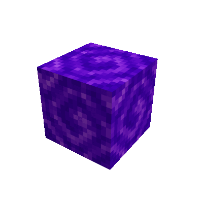

# 🏝 Lobby, Fishing and Mining Dimension (1.20)

Provides a easy to use lobby (with an underground maze), fishing and optimized mining dimension for you and your friends.

## Features ⭐

- Easy to use, no extra setup needed.
- Optimized mining dimension (configurable: without spawner, mobs, bats or minecart chest).
- Provides /lobby, /mining, /fishing and /spawn commands for the players.
- Changed automatically the user game mode depending on the dimension (excluding ops).
- Customization over the config file, data files and resource packs.
- Default lobby will be automatically expand with additional features like hidden places.
- Automatically transfer users to the lobby on first join and/or after server restart or always.
- Fall damage and fire damage protection for wrongly set default world spawn point.
- Teleport countdown and move detection to allow fair game play even in PVP.
- Integration for [FTB Essentials][ftbessentials] to support `/back` history command.

**Note: Please make sure to create regular backups of your dimensions, before installing or updating this mod.**

## 🏕️ Lobby Dimension

The lobby dimension is a place to hang out with friends or to enjoy some of the provided content (wip).
But you are free to build your own lobby as well or you can just expand the existing lobby.

All players are automatically in the adventure game mode in the lobby.

![Screenshot of the lobby dimension][lobby_dimension]

## ⛏️ Mining Dimension

The mining dimension will be generated on the first load over the `/mining` command.
It will not include any treasure chest or any mobs, so it could be only use for mining.
(This could be changed over the config file, if needed.)

You will start in a mining base which provides you some of the basic stuff.
To return to the mining base just use the `/mining` command.

![Screenshot of the mining dimension][mining_dimension]
![Screenshot of the mining dimension_basement][mining_dimension_basement]

**Note:** The first load of the dimension could take some time, because the need to generate the world and preparing the spawning area.

## 🐟 Fishing Dimension

The fishing dimension will be generated on the first load over the `/fishing` command.
It will include only fish's and ocean relevant structures.
All players are automatically in the adventure game mode in the fishing dimension.

![Screenshot of the fishing dimension][fishing_dimension]

## 🎲 Gaming Dimension

The optional gaming dimension could be enabled over the config file and could be used as based for your gaming dimension.

## 🕳️ Void Dimension

The optional void dimension could be enabled over the config file and could be used for anything else like mob farm or PVP area.

## #️⃣ User Commands

- **/fishing** teleports you to the fishing dimension
- **/lobby** teleports you to the lobby
- **/mining** teleports you to the mining dimension
- **/spawn** teleports you to the overworld
- **/gaming** teleports you to the overworld
- **/void** teleports you to the overworld

Note: The command names could be adjusted over the config file.

## ⚙️ Customization

You can customize the fishing, gaming, lobby, mining and void dimension over data files or by changing to creative mode.

**Please make sure to create regular backups for your lobby and/or customized mining dimension.**

### 🏕️ Lobby Customization ⚙️

The lobby will be automatically in the game mode adventure.
Use the following data files to customize the lobby:

- `data/lobby/dimension/lobby_dimension.json`
- `data/lobby/dimension_type/lobby_dimension.json`
- `data/lobby/functions/lobby_dimension_load.mcfunction`
- `data/worldgen/biome/biome_lobby.json`

**Note:** The `lobby_dimension_load.mcfunction` file will be only loaded once (per world) to make sure your changes are not overwritten.

### ⛏️ Mining Customization ⚙️

The optimization are parts of the code, you can use the following data files for customization:

- `data/lobby/dimension/mining_dimension.json`
- `data/lobby/dimension_type/mining_dimension.json`
- `data/lobby/functions/mining_dimension_load.mcfunction`

**Note:** The `mining_dimension_load.mcfunction` file will be only loaded once (per world) to make sure your changes are not overwritten.

### 🐟 Fishing Customization ⚙️

The fishing dimension will be automatically in the game mode adventure.
Use the following data files to customize the lobby:

- `data/lobby/dimension/fishing_dimension.json`
- `data/lobby/dimension_type/fishing_dimension.json`
- `data/lobby/functions/fishing_dimension_load.mcfunction`
- `data/worldgen/biome/biome_fishing.json`

**Note:** The `fishing_dimension_load.mcfunction` file will be only loaded once (per world) to make sure your changes are not overwritten.

## 🌐 Translations / Messages

The messages and text could be adjusted over the translation file [en_us.json][en_us.json] in a resource pack.

A resource pack example is available at [customization/resourecepacks/](customization/resourecepacks/).

### Custom Welcome Messages

You can use the following placeholders inside each of the welcome messages:

- `%1$s` Teleport command for fishing dimension
- `%2$s` Teleport command for gaming dimension
- `%3$s` Teleport command for lobby dimension
- `%4$s` Teleport command for mining dimension
- `%5$s` Teleport command for default dimension
- `%6$s` Teleport command for void dimension

Example: `Welcome to the default dimension, please use the %1$s, %3$s or %4$s command to change to a different dimension.`

### Custom Teleport Countdown Messages

You can use the following placeholders inside the teleport countdown messages:

- `%1$s` Dimension name
- `%2$s` Teleport delay or remaining delay time

Example: `Teleporting to %1$s in %2$s secs, please stand still!` or `Teleporting to %1$s in %2$s secs ...`

## ❓FAQ

### How can I reset a dimension ?

Just delete the dimension and the basic structures will be automatically regenerated after the server restart.

Relevant folders:

- `dimensions/lobby/fishing_dimension`
- `dimensions/lobby/gaming_dimension`
- `dimensions/lobby/lobby_dimension`
- `dimensions/lobby/mining_dimension`
- `dimensions/lobby/void_dimension`

### How can I reset the default bases like the mining base, fishing base or the spawn without resetting the dimension ?

Teleport to the corresponding dimension and run the corresponding functions like:

- `/function lobby:fishing_dimension_load`
- `/function lobby:gaming_dimension_load`
- `/function lobby:lobby_dimension_load`
- `/function lobby:mining_dimension_load`
- `/function lobby:void_dimension_load`

**Note: This will overwrite any existing block, but no entities see <https://bugs.mojang.com/browse/MC-102430>.**

### How can I remove all entities from the mining dimension from other Mods ?

Just use the following admin command: `/execute in lobby:mining_dimension run kill @e[type=!player,distance=0..]`

### The users are not instantly transferred to the lobby dimension on their first join. Any way to fix this ?

Unfortunately to avoid any side effects with other mods, the user needs first to join the overworld so that all mods are able to sync their data.
As soon these data are synced the user could be transferred to the lobby dimension without any issues.
The transfer could be disabled in the related config file.

### Will there are 1.16.5 version ?

There are already a lot of dimension mods for 1.16.5 which are covering similar functionality like:

- <https://www.curseforge.com/minecraft/mc-mods/advanced-mining-dimension>
- <https://www.curseforge.com/minecraft/mc-mods/rftools-dimensions>
- <https://www.curseforge.com/minecraft/mc-mods/rftools>
- <https://www.curseforge.com/minecraft/mc-mods/aroma1997s-dimensional-world>
- <https://www.curseforge.com/minecraft/mc-mods/dimensionaldoors>
- <https://www.curseforge.com/minecraft/mc-mods/hunting-dimension>
- <https://www.curseforge.com/minecraft/mc-mods/ftb-team-islands-forge>

I see not really any reason why there should be "another" dimension mod for 1.16.5, which only provides the basic functionality.

### I get the message "Worlds using Experimental Settings are not supported"?

This message is expected for all "custom" dimension, because the mod is using separate custom dimensions you will see this message with this mod.
The message could be disabled with mods like [Shutup Experimental Settings!][shutup-experimental-settings].

### I installed the mod, but it is not working?

There are some mods which blocking the custom dimension creation until they have created their custom dimensions.
If this happens other mods are not able to create their customer dimension on the first start.
Normally the issue is fixed by just restarting the server, you will additionally see a message in the log if this is needed.

### Will there are fabric version ?

Unfortunately I have no time to work on a separate fabric version.

### How to remove the mod and restore my former world ?

The mod adds the new dimension over data-packs, as soon you remove the mod, these data-packs are missing and Minecraft is unable to create the additional dimensions.

**The easiest way would be to restore the recommend backup you created before installing or updating the mod.**

For more details, please check: [How to restore your world ?][how_to_restore_your_world]

## Version Status Overview 🛠️

| Version        | Status                |
| -------------- | --------------------- |
| Fabric Version | ❌ Not planned        |
| Forge 1.16.5   | ❌ Not planned        |
| Forge 1.17.1   | ❌ Not planned        |
| Forge 1.18.1   | ⚠️ Deprecated         |
| Forge 1.18.2   | ⚠️ Maintenance only   |
| Forge 1.19     | ⚠️ Deprecated         |
| Forge 1.19.1   | ⚠️ Deprecated         |
| Forge 1.19.2   | ⚠️ Deprecated         |
| Forge 1.19.3   | ⚠️ Deprecated         |
| Forge 1.19.4   | ⚠️ Maintenance only   |
| Forge 1.20     | ⚠️ Deprecated         |
| Forge 1.20.1   | ✔️ Active development |

## Note

Please only download the mod from the official CurseForge page or with the official CurseForge launcher like:

🏝 [Lobby, Fishing and Mining Dimension][mod_page]

If you are downloading this mod from other sources we could not make sure that it works as expected or does not includes any unwanted modification (e.g. adware, malware, ...).

[mod_page]: https://www.curseforge.com/minecraft/mc-mods/lobby
[fishing_dimension]: https://raw.githubusercontent.com/MarkusBordihn/BOs-Lobby/main/examples/fishing_dimension.png
[lobby_dimension]: https://raw.githubusercontent.com/MarkusBordihn/BOs-Lobby/main/examples/lobby_dimension.png
[mining_dimension]: https://raw.githubusercontent.com/MarkusBordihn/BOs-Lobby/main/examples/mining_dimension_v5.png
[mining_dimension_basement]: https://raw.githubusercontent.com/MarkusBordihn/BOs-Lobby/main/examples/mining_dimension_basement_v5.png
[shutup-experimental-settings]: https://www.curseforge.com/minecraft/mc-mods/shutup-experimental-settings
[en_us.json]: src/main/resources/assets/lobby/lang/en_us.json
[how_to_restore_your_world]: doc/HOW_TO_RESTORE_YOUR_WORLD.md
[ftbessentials]: https://www.curseforge.com/minecraft/mc-mods/ftb-essentials-forge
