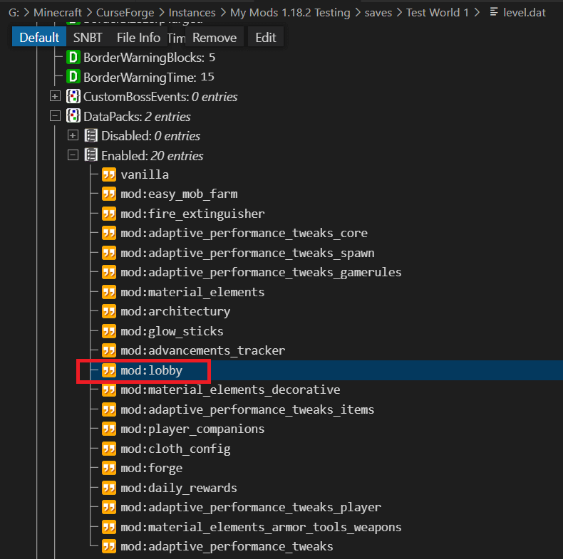
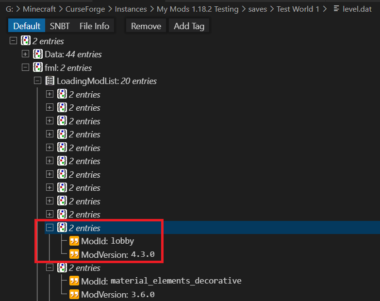

# How to restore your world❓

The mod adds the new dimensions over data-packs, as soon you remove the mod, these data-packs are missing and Minecraft is unable to create the additional dimensions and displays an loading error.

**Before going on, make sure that you create a full backup of your world and that you make changes only to this backup version.**

## 👍 How to restore your world with a backup

The easiest way would be to restore the recommend backup you created before installing or updating the mod.

In most cases it's already enough to copy the former level.dat` to the current world.

**Note: Copy the former `level.dat` only works in the case you haven't added any new mods or major changes in between!**

## 👉 How to restore your world without a backup

**⚠️ Make sure that you created a backup of your world! ⚠️**

In the case you haven't created any recommend backups, you need to make sure to remove all references to the lobby data packs.

You need to use an corresponding NBT editor to be able to edit the `level.dat` file like:

- <https://marketplace.visualstudio.com/items?itemName=Misodee.vscode-nbt> _(Visual Studio Code - Extension)_
- <https://github.com/tryashtar/nbt-studio>

### 1. Make sure that all players are in the overworld `/spawn`, so that no player has a reference to the lobby dimensions

### 2. Remove the corresponding custom dimensions

Normally all custom dimension are stored in a separated folder inside your world folder:

- `dimensions\lobby`

Remove this whole folder to make sure that all data for these dimensions are removed.

### 3. Remove the lobby references in your `level.dat` file

The next one requires a NBT editor, open your `level.dat` with the NBT editor and perform the following steps.

#### ✏️ a. Remove the lobby DataPacks entry

You need to remove the **DataPacks** entry `mod:lobby` like:

#### ✏️ b. Remove the lobby dimensions from the WorldGenSettings

You need to remove all lobby **dimensions** inside the **WorldGenSettings** starting with `lobby:...` like:

#### ✏️ c. Remove the lobby mod entry from the LoadingModList

You need to search and remove the lobby mod entry like:

#### 💾 Save your changes

Depending on your used NBT Editor it could be that you need to confirm your changes by saving the file.

After these steps your world should load without any error message.

**Note: The lobby mod is not adding any new items or entities, so the level / world data should not contain any lobby reference.**
